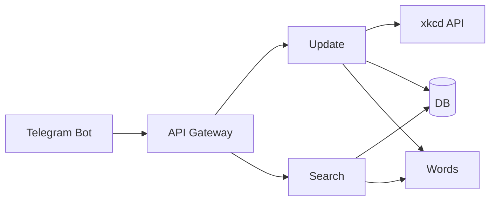

# Comics Finder Telegram Bot 🤖📚

**Telegram-бот для поиска комиксов с [xkcd](https://xkcd.com) с микросервисной архитектурой на Go**


## 🌟 О проекте

- 🔍 Умный поиск по ключевым словам
- 👩‍💼 Разделение ролей (пользователь и администратор)
- 🚀 Высокая производительность за счет индексации
- 🏗 Модульная архитектура для легкого масштабирования, gRPC микросервисы
- 🐳 Сборка через Docker Compose
- 🧪 Покрытие Unit и интеграционными тестами

## 🛠 Технологический стек


- **Go (Golang)** - основной язык разработки
- **Telegram Bot API** - взаимодействие с пользователями
- **gRPC** - межсервисное взаимодействие
- **PostgreSQL** - база данных
- **Docker + Compose** - средство запуска

## 👾 Команды бота
### Пользователь
```
/start - Приветственное сообщение
/help - Список команд
/search [query] - Поиск комиксов по ключевым словам
/admin - Вход как администратор
```
### Администратор
```
/update - Обновление базы комиксов
/drop - Удалить базу комиксов
/stats - Статистика базы комиксов
```
